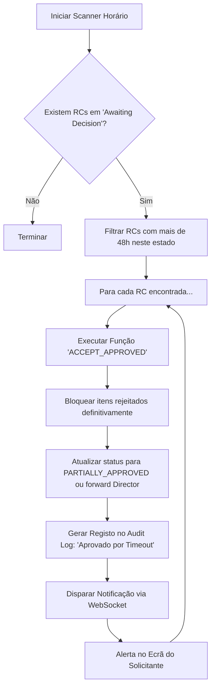

# ⏱️ Proposta: Timeout de 48h para Decisão do Solicitante

Esta proposta detalha a arquitetura para implementar o **Gatilho de Auto-Aprovação** caso o solicitante não tome ação em 48h após a rejeição parcial de itens.

---

## 💡 Utilidade e Benefícios

1.  **Fim dos Gargalos:** Evita que uma Requisição com 10 itens aprovados fique **parada infinitamente** porque 1 item foi rejeitado e o solicitante está ausente/férias.
2.  **Melhoria no SLA:** Mantém a velocidade da cadeia de suprimentos garantindo que o que *está certo* avance.
3.  **Autonomia Controlada:** O solicitante continua a ter voz, mas há um limite de tempo para não prejudicar a operação.

---

## 🛠️ Arquitetura Técnica (Como Implementar)

Para que o sistema saiba que passaram 48h, precisamos de **duas coisas**:

### **1. Memória (Banco de Dados)**
Atualmente, o modelo `PurchaseRequest` não regista o momento exato em que entrou no estado `AWAITING_REQUESTER_DECISION`.
*   **Mudança Requerida:** Adicionar um campo `awaiting_decision_since = models.DateTimeField(null=True)` no modelo.
*   **Ação:** Ao mudar para este status na API, grava-se `timezone.now()`.

---

### **2. O Mecanismo de Gatilho (Trigger)**
Como o tempo passa e o computador precisa de "acordar sozinho" para executar a ação, temos **duas opções de Arquitetura**:

| Opção | Como Funciona | Prós | Contras |
| :--- | :--- | :--- | :--- |
| **Opção A: Cronjob (Script Periódico)** | Um script corre de hora em hora e busca RCs onde `status == 'AWAITING_REQUESTER_DECISION'` e `awaiting_decision_since < (hoje - 48h)`. | Simples de configurar, baixa manutenção. | Podem haver atrasos de até 1 hora na execução. |
| **Opção B: Celery & Redis (Task Queue)** | Um "cronómetro" é disparado no momento em que a RC entra no estado. Exemplo: `auto_approve_parcial.apply_async(countdown=172800)`. | **Execução Exata ao segundo.** | Requer servidores secundários ligados (Celery). |

> [!TIP]
> **Recomendação:** A **Opção A (Cronjob)** é a mais segura e fácil de introduzir sem sobrecarregar a infraestrutura atual, pois 1 hora de atraso num limite de 48h é irrelevante para a operação.

---

## 📊 Fluxo Lógico do Script Automático

---
*Deseja avançar com a **Opção A (Cronjob)**? Se sim, posso gerar o plano de código para os ficheiros.*
